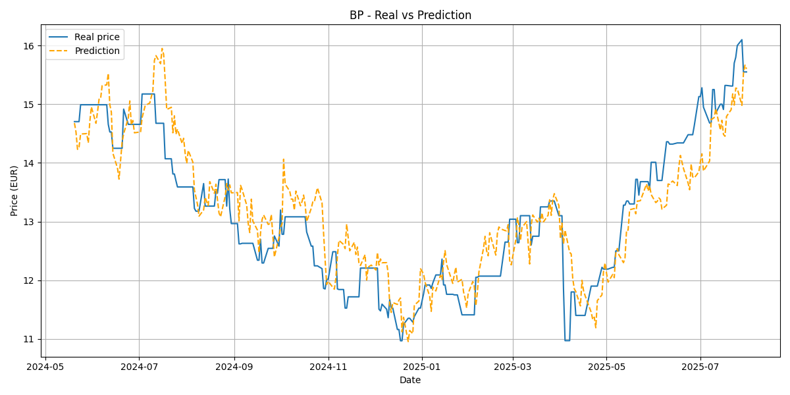

# 📈 Misco — Stock Price Predictor

> A handcrafted neural network for stock market forecasting, written 100% in Rust with no external ML libraries.

**Misco** is a collaborative project by [@miguevrgo](https://github.com/Miguevrgo) and [@gonzaloolmo19](https://github.com/gonzaloolmo19) to build a performant, reproducible stock forecasting pipeline from scratch. The network learns from historical OHLC (Open, High, Low, Close) data of a training universe and evaluates generalization on a separate set of tickers it has never seen.

---

## 🏗️ Architecture

| Component | Details |
|-----------|---------|
| **Input** | 512 days of historical close prices |
| **Hidden layers** | 2 × 256 neurons, ReLU activation |
| **Output** | 1 neuron, linear (next-day close price) |
| **Training** | Mini-batch SGD with MSE loss |
| **Framework** | 100% handcrafted Rust — no PyTorch, no ONNX, no shortcuts |

## 📊 Dataset

| Set | Tickers | Companies |
|-----|---------|-----------|
| 🏋️ **Train** | `BP`, `E`, `EQNR` | BP plc, Eni S.p.A., Equinor ASA |
| 🧪 **Test** | `REPYF`, `SHEL`, `TTE` | Repsol S.A., Shell plc, TotalEnergies SE |

Data is fetched via [yfinance](https://github.com/ranaroussi/yfinance) (20 years of daily OHLC).

<div align="center">
  
</div>

---

## 🚀 How to Use

### Prerequisites

- **Rust** (stable, 2024 edition) — [install](https://rustup.rs/)
- **Python 3** — for data download and plotting
- **Make** — for convenience targets

### 1. Setup

Clone the repo and download stock data:

```bash
git clone https://github.com/Miguevrgo/Misco.git
cd Misco
make kickstart
```

This creates a Python venv, installs `yfinance`/`matplotlib`, and downloads 20 years of OHLC data into `data/`.

### 2. Train

Train the neural network on the training tickers:

```bash
make train
```

The trained model is saved to `models/network.bin`. Training prints per-epoch loss and ETA.

### 3. Test

Evaluate the model on unseen test tickers and generate `predictions.csv`:

```bash
make test
```

Prints average MAE and MSE loss. Then generate plots:

```bash
make graph
```

### 4. Predict

Run a single next-day prediction on a test ticker:

```bash
make predict
```

### 5. Stonks 💹

Simulate a simple buy/sell strategy using the model's predictions:

```bash
make stonks
```

Starts with $1000 and trades based on predicted price direction. Prints final performance.

---

## 📁 Project Structure

```
Misco/
├── src/                  # Rust source code
│   ├── main.rs           # Entry point + feature-gated modes
│   ├── network.rs        # Neural network (forward, backprop, SGD)
│   ├── stock.rs          # Stock data structures + normalization
│   ├── entry.rs          # Date + StockEntry types
│   ├── portfolio.rs      # Multi-stock portfolio management
│   └── display.rs        # Terminal-width-aware box printing
├── scripts/              # Python tooling
│   ├── download_data.py  # Fetch OHLC data via yfinance
│   └── plot_results.py   # Plot predictions vs reality
├── data/                 # Stock CSV files (downloaded)
├── models/               # Trained network + checkpoints
├── docs/                 # Images and documentation assets
├── Cargo.toml
├── Makefile
├── ROADMAP.md            # Planned improvements (phases 1-6)
└── LICENSE               # MIT
```

## 🛣️ Roadmap

See [ROADMAP.md](ROADMAP.md) for the full plan, including:

- **Phase 1** — Adam optimizer, learning rate scheduling, gradient clipping, Huber loss, dropout
- **Phase 2** — Batch normalization, residual connections, multi-feature OHLCV input
- **Phase 3** — LSTM / GRU temporal architectures
- **Phase 4** — Attention mechanisms and Transformers
- **Phase 5** — Feature engineering (returns, technical indicators, augmentation)
- **Phase 6** — SIMD, GPU acceleration, ensemble methods

## ⚠️ Disclaimer

This project is **experimental** and should **not** be used for real-world investment decisions. It is a research and learning prototype.

## 📄 License

[MIT](LICENSE) — Miguel Angel De la Vega Rodriguez
