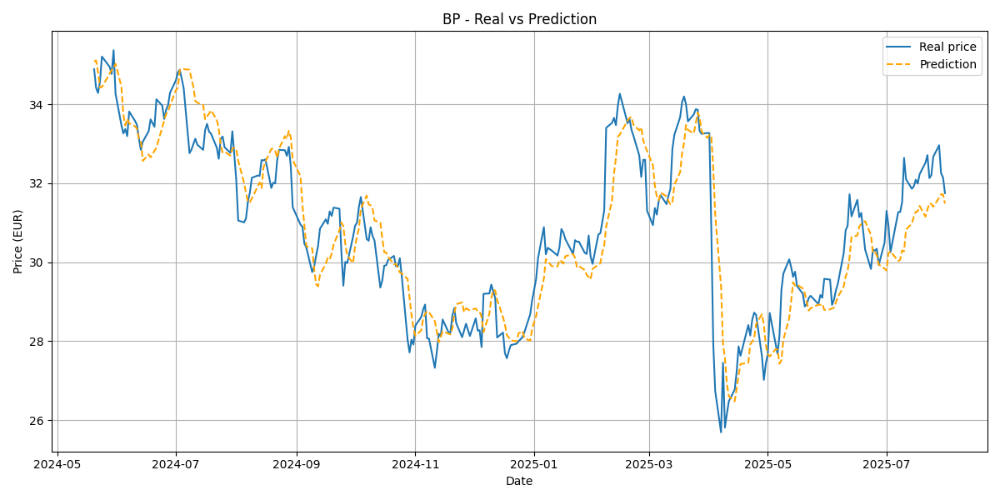

# Misco
Misco is a collaborative project by gonzaloolmo19 and miguevrgo to build a performant, reproducible stock market forecasting pipeline in Rust. The initial goal is to implement a customizable neural network that learns from historical OHLCV (Open, High, Low, Close, Volume) data (and optionally engineered features) for a training universe of tickers, then evaluates generalization on a separate test ticker set.

# Dataset
*Training*
Repsol S.A.
BP PLC
Shell PLC
*Test*
TotalEnergies SE
Equinor ASA
Eni S.p.A.

  

